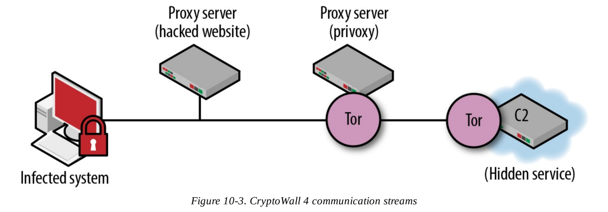

## Deployment
- Strategic web compromise(watering-hole attacks) : https://www.youtube.com/watch?v=RNWiqj_lkcs
- Drive-by download : Occurs when a system automatically downloads a piece of malware
- Phishing emails
- Exploiting vulnerabilities

### Prevention
- virtual sandbox
- Bare-metal sandbox

## Installation
One method of installation would actually use the download dropper methodology, where the first file is a small piece of code designed to evade detection and communicate with extortionist’s command-and-control channels. The executable would then receive commands to download the ransomware itself for infection on the compromised system. Once it has landed on the system, the ransomware application will install itself on the system.

- Change settings to run itself when the computer opens
- Disable the firewall/antivirus
- Delete logs / Disable recovery enviroments

## C&C
In a ransomware attack, once the malicious code is deployed and installed, it will begin to reach out to its command servers, looking for instructions.

Command-and-control channels vary with the different variants and families of malware. In some cases, these can be as simple as web-based communications leveraging an unencrypted HTTP protocol to complicated systems that leverage embedded TOR services to connect. The more complex systems like TOR make it even more difficult to trace the exact location of the criminals participating in the extortion, and indeed some of the ransomware variants actually install TOR clients on end-points to ensure they have secure communications.

## Destruction
The ransomware will encrypt all files it's determined on the victim device.

### Symmetric Key Encryption
- fewer system resources as a result reduce detection
- A major disadvantage of symmetric key encryption is that is can be defeated. It is possible for a user to pull the key from active memory and use this to decrypt the files on the system while it is offline.

### Asymmetric Key Encryption
- The public key is used on the infected system to encrypt the files, and the private key is used to decrypt the files.

-In ransomware that leverages an embedded public key, the methodology is fairly straightforward and can be initiated whether the computer is online or not. The disadvantage of this technique is that a new public key must be genereated for each attack.

Encrypt all files with individual AES key(Symmetric) then encrypt all AES keys with server public RSA key(Asymmetric). ransomware will produce a special AES key for each file.

## Extortion
The victims are shown a screen that tells them how they have been compromised. Extortionists use any number of methods to enforce payment.

System or Browser Locking

- you will get 50% discount if you pay on the day of infection
- each passing day, buying the cost of storing decryptor key become more expensive
- after XxX day, the decryptor key will be deleted

it depends on your imagination

# ATTACK CHAIN
1. The ransomware must execute and unpack itself and then collect system information.
2. The ransomware has to change registry settings to maintain persistence.
3. More advanced ransomware disables system restore and deletes everything in the Volume Shadow Copy (VSC).
4. Most, but not all, ransomware has to call out to command-and-control infrastructure to get a public key that will be used to encrypt the files.
5. The ransomware now has to enumerate the files.
6. It then begins to read and encrypt the files.
7. If each encrypted file is written to a new file, the original files must be deleted.
8. Finally, the encryption key is removed from the local machine and sent back to the controller.

# DGA command-and-control channels.
These are used by malware to create pseudorandom domains that are either unregistered or registered in bulk. If the domains are unregistered, there is a pretty good chance that you have already suffered DNS cache poisoning and need to take a look at how to secure your DNS servers. DNS cache poisoning is an attack where  corrupt domain name system data is introduced into a DNS resolver’s cache, causing the name server to return an incorrect IP address, which results in diverting traffic to the attacker’s computer. The appeal of conducting criminal activity with DGA infrastructures is pretty basic: 
- Static reputation-based blacklisting mechanisms are impossible to update at the speed at which DGAs can be generated.
- Criminal organizations can create nimble command-and-control infrastructures that can be brought up and down as needed.
- Traditional edge-based network filtering will often fail to find these outbound connections.
- Domain name registration can be done as the ransomware is released or executed to provide just-in-time (JIT) connections, limiting the feasibility of reactive countermeasures.
- Ransomware actors can propagate a large presence without ever exposing their command-and-control infrastructure because it is constantly on the move.

The biggest thing to note is that most DGAs are not like the sample referenced above, a string of words that could potentially make sense to someone. Instead, most DGAs leverage random characters to create meaningless garbled URLs that in all likelihood haven’t been registered. This means one thing you can look for in your outbound traffic and DNS lookup services is attempts to resolve meaningless domains. Another thing to look for would be an increase in searches for nonexistent domains, because the DGAs on the ransomware will cycle through all of the domains in their detection algorithms and usually not hit on the first one (usually that is).

# CERBER

As noted, more than half of all Cerber attacks originate with spam, which often contains a **macro embedded in a Microsoft Office document that contains a VBScript that calls PowerShell to initiate a download of Cerber**. Chapter 4 discussed the option of disabling the Windows scripting engine, but it also might be worthwhile to disable PowerShell on systems where it is not necessary.

# LOCKY

Before starting the encryption process, Locky has to enumerate the files and delete any shadow copies, so it issues the following command:
    
    *vssadmin.exe Delete Shadows /All Quiet*

Locky uses a combination of RSA and AES encryption. The RSA key is the public/private key pair generated by the command-and-control infrastructure and is used to generate unique 256-bit AES keys to encrypt select files on the victim machine. Earlier versions of Locky only used 128-bit AES keys, but all new variants have updated to 256-bit.

# CryptXXX

One way ransomware can detect if it is running in a virtual environment is simply by checking the output of the systeminfo command. If the system manufacturer is listed as “VMWare,” then the attacker knows it is a virtual environment and the ransomware should not run. That is a simple example and one that is easy to fix, but there are more advanced techniques that attackers can use to check the victim environment and prevent execution.

The second thing the team behind CryptXXX did to avoid detection by sandbox technologies is to put a delay in the ransomware. Some researchers report that CryptXXX will often wait as long as an hour before it executes. Because most sandbox vendors need to execute incoming files rapidly, they do not have the ability to wait an extended period for a file to execute. The assumption is that once a system is exploited the ransomware will execute immediately, so the virtual machines are shut down quickly.To avoid detection, ransomware developers will put the delay in, and the sandbox will not be able to record the malicious behavior; it may even think the file is benign. A second trick some ransomware developers implement is to wait until after a system reboots to launch the encryption process, again, foiling many sandboxing vendors.

The other advantage of delaying the start of the encryption process is that it puts separation between the initial exploit and the ransomware activity. This creates a potential problem for incident-response or forensics teams trying to reconstruct the attack. Over the course of an hour it is possible for a user to visit dozens of websites and, with the way ad networks work, hundreds of URLs. Trying to identify which of those sites were responsible for the original attack, especially if that site is not always serving up exploits, becomes a significant challenge. This makes it more difficult for the security team to protect the network by identifying and blocking a potentially bad domain name or the exploit that was used to launch the attack.

# CryptoWall
- Hack the vulnerable website.
- Use this website as a proxy for communication

## Open Source Ransomware

- https://github.com/mauri870/ransomware :: go :: 
- https://github.com/tarcisio-marinho/GonnaCry :: py :: veryNice
    - Ransomware Impact on industry: https://medium.com/@tarcisioma/how-can-a-malware-encrypt-a-company-existence-c7ed584f66b3

    - How this ransomware encryption scheme works: https://medium.com/@tarcisioma/ransomware-encryption-techniques-696531d07bb9

    - How this ransomware works: https://medium.com/@tarcisioma/how-ransomware-works-and-gonnacry-linux-ransomware-17f77a549114
- https://github.com/sithis993/Crypter :: py :: .NET
- https://github.com/wille/cry :: go
- https://github.com/leonv024/RAASNet :: py :: .NET :: Ransomware as as Service => C&C interface

## Open Source BotNet
- https://github.com/nettitude/PoshC2 :: py :: a proxy aware C2 framework 
- https://github.com/leonv024/RAASNet :: py :: .NET :: Ransomware as as Service => C&C interface
- https://github.com/NYAN-x-CAT/Lime-RAT :: visualBasic :: .NET
- https://github.com/UBoat-Botnet/UBoat :: py :: A proof-of-concept HTTP Botnet
- https://github.com/malwaredllc/byob :: py
- https://github.com/epsylon/ufonet :: py :: P2P and cryptographic -disruptive toolkit
- https://github.com/sweetsoftware/Ares :: py :: Remote Access Tool

## Smart Contract

- https://arxiv.org/pdf/2003.04426.pdf
- https://medium.com/reserve-currency/smart-contracts-will-make-ransomware-more-profitable-part-1-a687fc370320
- https://medium.com/reserve-currency/smart-contracts-will-make-ransomware-a-lot-more-profitable-part-2-1a316ad56fdf

## Blog for Ransomware Analysis

- varonis.com
- sentinelone.com
- secureworks.com 
- fireeye.com
- zscaler.com
- malware-traffic-analysis.net
- blog.talosintelligence.com
- unit42.paloaltonetworks.com
- trendmicro.com
- blogs.cisco.com
- www.malwaretech.com

